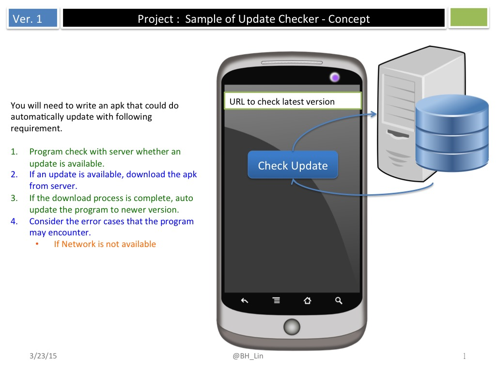
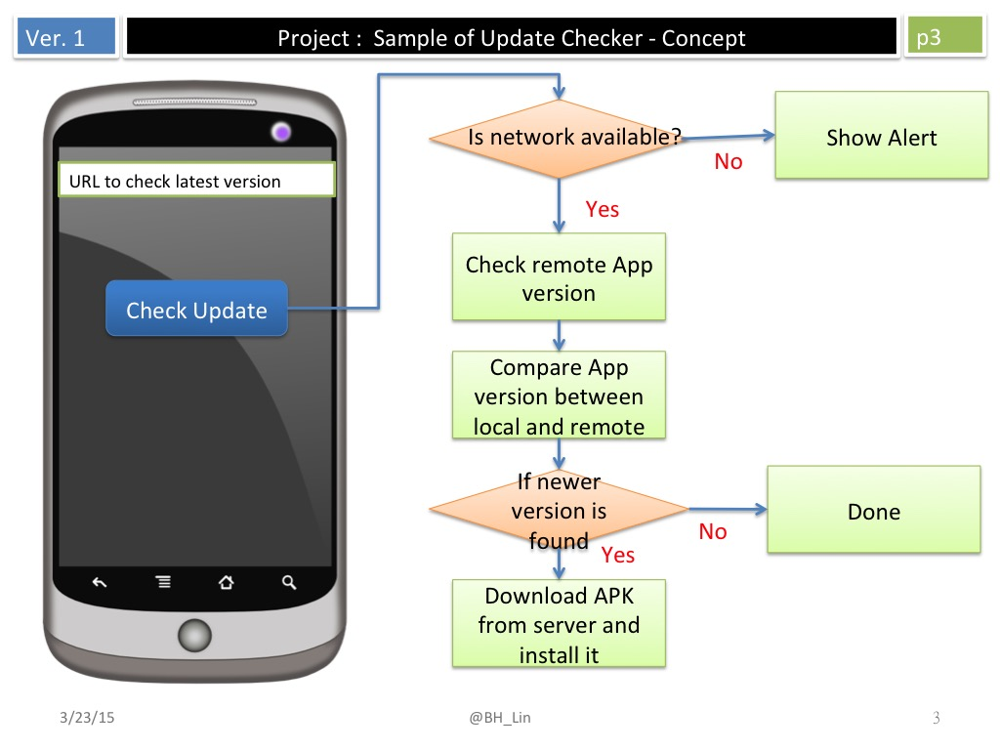
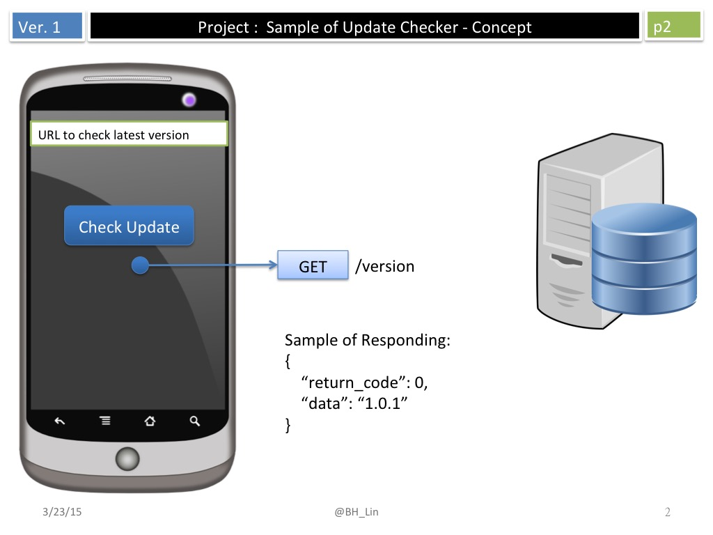

#		Sample to check update for Android
## 	[Program] An automatically software update service on Android platform.

### You will need to write an apk that could do automatically update with following requirement.

* Program check with server whether an update is available.
* If an update is available, download the apk from server.
* If the download process is complete, auto update the program to newer version.
* Consider the error cases that the program may encounter.

